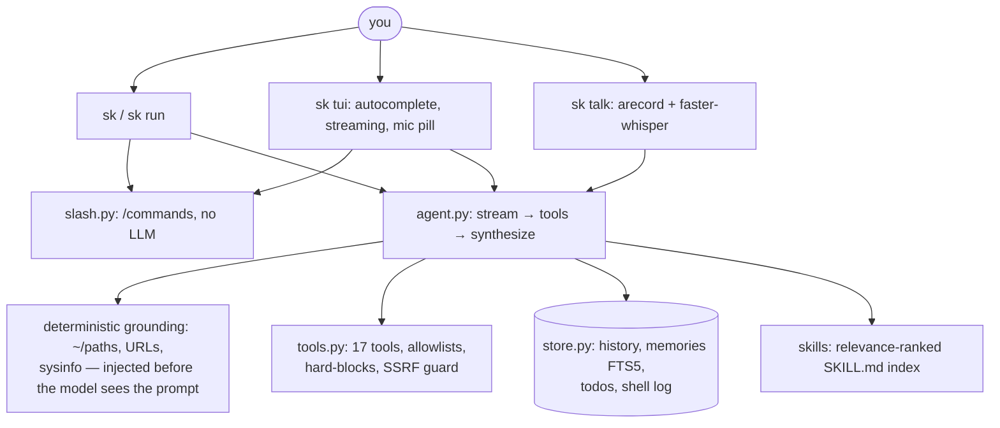

<div align="center">

# Sidekick

**A local-first terminal companion you can talk to — chat, voice, and 17 tools, on your hardware.**

[](https://www.python.org/)
[](https://textual.textualize.io/)
[](https://ollama.com/)
[](LICENSE)
[](tests/)

*No cloud account required. No API bill by default. Your files, memory, and voice never leave your machine unless you hand it a key.*

</div>

## See it

Slash autocomplete with fuzzy filtering, right in the prompt:


A grounded answer — real tools, real system data, streamed live:


*Screenshots are real SVG captures of the app running headless (`docs/shot.py`), not mockups.*

```console
$ sk brief
╭─ sidekick brief  Sat 2026-09-19 11:58 ─╮
│ CPU: AMD Ryzen 7 4800H (16 threads)     │
│ Mem: 7.2Gi · GPU: GTX 1650 4GB          │
│ /dev/nvme0n1p8  133G  117G  8.5G  94% / │
╰─────────────────────────────────────────╯
│ ! disk 94% full — clean ~/Downloads…    │

$ sk run "what is the ideal llm i can run on my device"
• qwen3:4b (2.5 GB): fits comfortably in your 4096 MiB VRAM.
• llama3.2:3b (2.0 GB): another good option.

$ sk talk
[Enter] to record, [Enter] to stop. /quit exits.
heard> what files are in the sidekick repo
```

## Why sidekick

| | Sidekick | Typical cloud agent |
|---|---|---|
| Runs fully offline (Ollama) | ✅ | ❌ |
| Voice input, transcribed on your CPU | ✅ | ❌ |
| Copy/paste that works in-terminal | ✅ drag-select, `ctrl+y`, `/copy` | varies |
| Answers grounded in *your* system, not guessed | ✅ deterministic grounding | prompt-only |
| Skills you can read (`SKILL.md`, incl. superpowers) | ✅ | varies |
| 443-test suite incl. prompt-regression evals | ✅ | rare |

## Quickstart

```bash
uv tool install sidekick-agent[voice]   # global `sk`, STT included
sk init                                  # guided first-run: hardware → model → verify
sk                                       # fullscreen chat — start here (`sk tui` works too)
```

No clone, no build — installs straight from PyPI. Requires Python 3.12+.
Without `[voice]` you get everything except Talk/mic (installs on first use instead). Local path needs Ollama (`ollama serve`, pull `qwen2.5-coder:7b` for smarts or `llama3.2:3b` for speed).

## Install

| Channel | Command |
|---|---|
| PyPI / uv | `uv tool install sidekick-agent[voice]` |
| PyPI / pipx | `pipx install sidekick-agent[voice]` |
| PyPI / pip | `pip install sidekick-agent[voice]` |
| AUR (Arch) | `yay -S python-sidekick-agent` |
| conda-forge | `conda install -c conda-forge sidekick-agent` *(feedstock lives in a separate repo)* |

The published name is **`sidekick-agent`** (the `sidekick` name is taken on
PyPI); the command stays `sk`. Version is a single source of truth in
`src/sk/__init__.py`. Publishing is automatic and credential-free: when a PR
is merged to `main` of the canonical repo
[`Faisal-Fayaz/sidekick`](https://github.com/Faisal-Fayaz/sidekick) with a bumped
`__version__`, GitHub Actions trusted-publishes to PyPI and opens a GitHub
Release (forks can never publish) — details in [`packaging/README.md`](packaging/README.md).

**From source (dev):**

```bash
git clone https://github.com/Faisal-Fayaz/sidekick && cd sidekick
uv tool install -e ".[voice]"   # editable dev install; STT included
sk doctor
```

## Chat

One input, two surfaces — fullscreen TUI and plain-text REPL share every command:

```bash
sk                   # fullscreen chat with streaming + themes — start here
sk tui --model fast  # same, explicit form
sk chat              # fallback REPL: dumb terminals, screen readers, broken TUIs
```

Type `/` and an autocomplete popup filters all 20+ commands — Enter completes, Tab too, Esc dismisses, ↑/↓ navigates. `F1` opens a generated cheatsheet (keys + commands, built from the same tables as the dispatcher, so it can't rot).

TUI keys: **Enter** sends · **ctrl+j**/**alt+enter** newline · **↑/↓** history · **ctrl+y** copies · **ctrl+g** push-to-talk · **pgup/pgdn** scroll · **F1** help · **F2** dark/light theme · **F3** sessions drawer. Answers stream live as Markdown with role colors; approvals arrive as cards with timeout; the status bar shows model · session · last-turn time/tokens.

## Voice

```bash
sk talk [-d SECS] [--stt-model base] [--device hw:2,0]  # Enter records, Enter stops
sk mic-test                                             # peak dB + silent/quiet/good verdict
```

Capture via the OS-native recorder (arecord/ALSA on Linux, sox/ffmpeg on macOS), transcription via local faster-whisper int8, transcript lands editable in the prompt. In the TUI, `ctrl+g` (or the mic pill) does the same. Voice never leaves your machine; recordings are temp files, deleted after each take.

## MCP server

```bash
sk mcp [--allow-writes]   # JSON-RPC 2.0 over stdio, zero new deps
```

All 17 tools, same safety policy (SSRF guards, write blocklists, hard-refusals). Reads auto-run; shell/writes/delete need `--allow-writes`, else a clean denied error. Stdout carries protocol only. Claude Desktop snippet:

```json
{ "mcpServers": { "sidekick": { "command": "sk", "args": ["mcp"] } } }
```

## Providers (BYO key)

```bash
sk connect     # pick provider → paste key (hidden) → pick model → ping. Done.
```

One guided flow: numbered provider list (local ones skip keys), live validation *before* anything saves, curated model list (TTS/image junk filtered, recommended pre-highlighted, Enter accepts), and a 5-token ping instead of a full agent turn. Advanced paths still work: `sk auth add/list/status/remove`, `sk model`, `sk setup` (connect + hook), `sk config --provider openai --api-key sk-...`, `/provider groq` inside chat.

Presets: `ollama|openai|groq|together|deepseek|openrouter|google|lmstudio|anthropic|opencode|custom` (`anthropic` speaks the native Messages API; the rest are OpenAI-compatible). Any OpenAI-compatible endpoint works via `--provider custom --base-url https://... --api-key ...`. Preferred: `SIDEKICK_API_KEY` env (never touches disk); file keys are chmod 600 and masked in `--show`. The Anthropic backend marks the static system prompt + tool definitions cacheable (repeat turns up to 10x cheaper); OpenAI-compatible providers cache matching prefixes automatically server-side.

The `opencode` preset points at OpenCode Zen, opencode's gateway with a set of free, tools-capable models (`config.OPENCODE_FREE_MODELS`) plus paid tiers. The anonymous free tier is restricted by opencode to its own app, so add a free OpenCode account key first — `OPENCODE_API_KEY` env or `sk auth add opencode` (get it at opencode.ai/auth). Fast/smart resolve to `nemotron-3.5-lightning-free` / `muse-spark-1.3-contributor-free`; run `sk models opencode` for the live list.

## Command reference

| Command | What |
|---|---|
| `sk` / `sk tui [--continue]` | Fullscreen chat, fresh session each launch |
| `sk chat [--continue]` | Fallback plain-text REPL (dumb terminals, screen readers, TUI issues) |
| `/sessions`, `/resume <n>`, `/sessions delete <n>`, `/fork [n]` | List, switch, delete, branch past sessions |
| `sk run "task" [--yes] [--model auto\|fast\|smart\|name] [--json] [--bg] [--allow LIST]` | Single-shot agent run (auto-router picks the model; `--json` emits one machine-readable document + exit codes, use with `--yes` unattended; `--bg` detaches, returns a job id, notifies on completion; `--allow shell:pytest,write_file` skips prompts for listed tools) |
| `sk jobs [-n N]` | List background jobs from `sk run --bg` |
| `sk brief [-p PATH] [--smart]` | Morning digest: system + git + todos + memories, instant without LLM |
| `sk digest [--force]` | Teammate pilot: brief + overnight failures, desktop nudge or log |
| `sk remember/recall/memories/forget` | Long-term memory (FTS5 search, auto-injected) |
| `sk todo add/list/done/clear` | Todos |
| `sk history` / `sk oops` | Shell log / explain last failure |
| `sk export [SESSION] [--out f.md]` | Session transcript as Markdown (turns + tool calls) |
| `sk audit [--session S] [--format md\|json]` | Compliance log: tool runs, approve/deny, local-vs-egress |
| `sk stats [--session S] [--format md\|json]` | Usage + cost estimates from audit rows (turns, tools, tokens) |
| `sk hook-install [--write]` | Bash/zsh logging hook |
| `sk skills` / `sk skills-search` / `sk skills-registry [QUERY]` / `sk skills-install NAME` / `sk plugins` / `sk daemon [--once]` / `sk daemon-install [--schedule TXT]` / `sk daemon-schedule [--set TXT]` | Skill packs (registry + superpowers) / user-defined tools (`TOOLS.md`, see `docs/plugins.md`) / background watcher (systemd/launchd, calendar schedules) |
| `sk mcp [--allow-writes]` | MCP server over stdio (17 tools, safe defaults) |
| `sk doctor` / `sk models [pull <id> | prune <id>]` / `sk config` / `sk version` / `sk upgrade [--check]` | Health / models (list, download, remove) / settings / build / self-update |
| `sk init` / `sk setup` / `sk connect` | Guided first-run / full setup / provider key flow |

Packs use the `SKILL.md` frontmatter format. The prompt carries a relevance-ranked index; the agent loads full instructions on demand via the `skill` tool. `fast`/`smart` resolve per provider (Ollama: llama3.2:3b/qwen2.5-coder:7b, Groq: gpt-oss-20b/120b).

## Architecture



Design bets that paid off: **deterministic grounding beats prompt instructions** (small models ignore rules but can't argue with injected facts), **text-JSON fallback** (coders emit tools as text over the OpenAI endpoint), **FTS5 over vectors** (zero deps, instant, no embedding server on a 4GB box), **parallel reads** (approval-gated tools stay serial; independent reads run concurrently with failures isolated), **capability profiles over hope** (known models declare their tool protocol; the router reads them instead of paying a probing 400).

## Safety

Reads auto-run. Writes, deletes, and general shell need approval (inline `[y/N]` in TUI, prompt in CLI), HOME/`/tmp` only, ≤100KB, never `~/.ssh`, `~/.gnupg`, `/etc`, `/usr`. Multi-tool turns with destructive actions get **one plan review** up front instead of per-tool prompts (silent in `--yes`/`/yolo`; denials execute nothing). `shell` hard-refuses `rm -rf /`, `mkfs`, `dd` to devices, fork bombs even with approval. `read_url`/`web_search` block localhost/private IPs. API keys chmod 600, masked in output.

## Tests

```bash
uv run --python 3.12 --with ".[test]" pytest tests -q   # 443 passed: unit + regression + Textual pilot, no Ollama needed
```

The eval harness (`tests/test_eval.py`) locks in every past quality bug as an offline regression test. A suite-wide fixture guarantees tests never touch your live `~/.sidekick/`.

## Config

`~/.sidekick/config.toml` (`provider`, `model`, `base_url` override, `api_key`, …). Env overrides: `SIDEKICK_PROVIDER`, `SIDEKICK_MODEL`, `SIDEKICK_BASE_URL`, `SIDEKICK_API_KEY`. Data stays home: `history.db`, `skills/`, `nudges.log`, `input_history`, `tui-errors.log`.

**History budget:** `history_budget_tokens` (default 3000) caps per-turn history; over-budget sessions compact to a rolling summary via the current model (DB history stays complete). Lower it for small-context models.

**Per-project config:** a `.sidekick.toml` in any repo layers over the global file (nearest one walking up from cwd). It may set `provider`, `model`, `max_steps`, `temperature`, plus a `[project]` table (`docs` files injected into the prompt, `memory_namespace`, `approved_commands` for `shell`). `api_key`/`base_url` are *never* read from project files (global/env only) — `sk config --show` prints the active project and any ignored keys. `sk --cwd PATH` runs any command as if in that directory.

## Roadmap

See [`ROADMAP.md`](ROADMAP.md) — the shared plan (vision, `v0.2.0` / `v0.3.0` milestones, done list). It changes by pull request only.

## License

MIT — do what you want, shout-outs appreciated.
