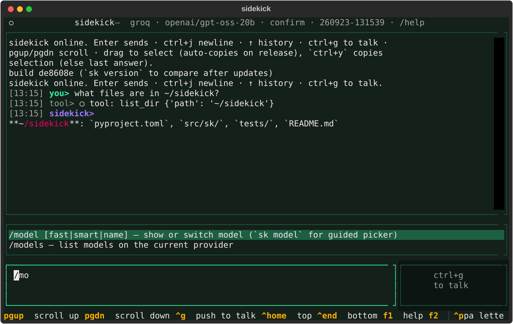
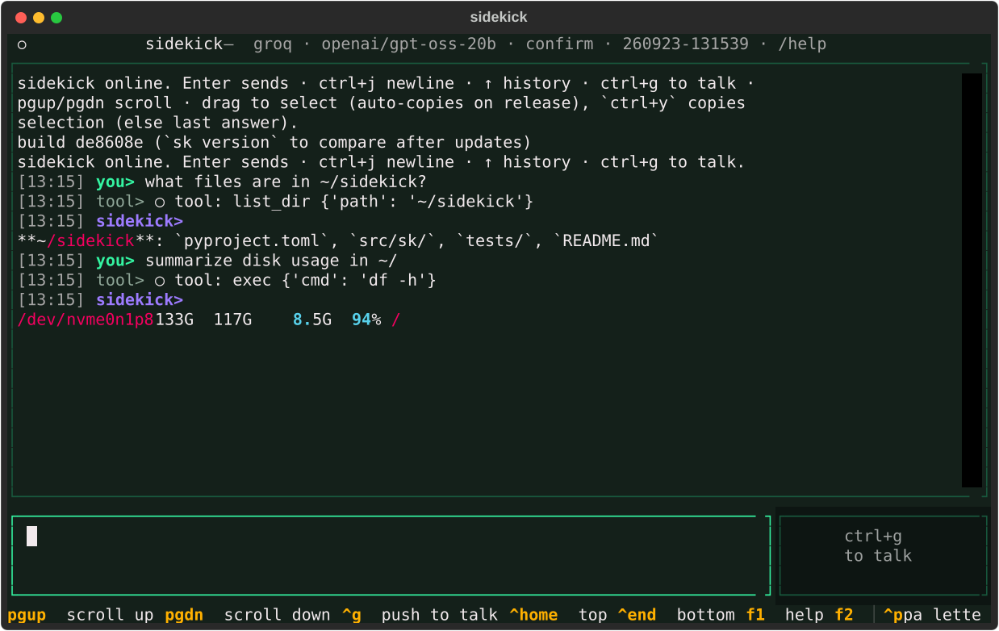
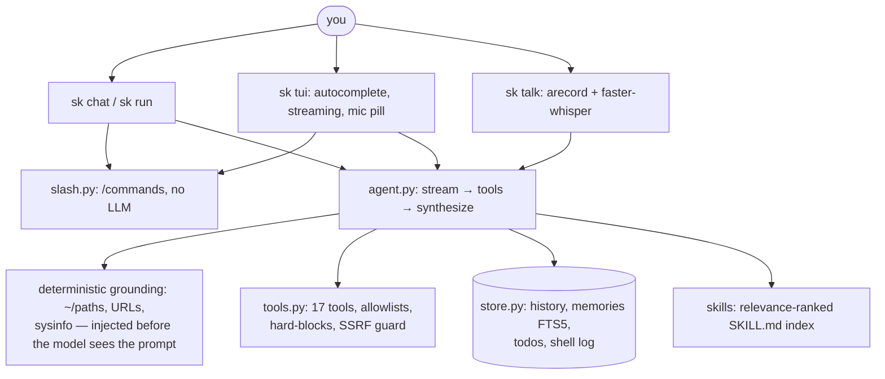

<div align="center">

# Sidekick

**A local-first terminal companion you can talk to — chat, voice, and 17 tools, on your hardware.**

[](https://www.python.org/)
[](https://textual.textualize.io/)
[](https://ollama.com/)
[](LICENSE)
[](tests/)

*No cloud account required. No API bill by default. Your files, memory, and voice never leave your machine unless you hand it a key.*

</div>

## See it

Slash autocomplete with fuzzy filtering, right in the prompt:



A grounded answer — real tools, real system data, streamed live:



*Screenshots are real SVG captures of the app running headless (`docs/shot.py`), not mockups.*

```console
$ sk brief
╭─ sidekick brief  Sat 2026-09-19 11:58 ─╮
│ CPU: AMD Ryzen 7 4800H (16 threads)     │
│ Mem: 7.2Gi · GPU: GTX 1650 4GB          │
│ /dev/nvme0n1p8  133G  117G  8.5G  94% / │
╰─────────────────────────────────────────╯
│ ! disk 94% full — clean ~/Downloads…    │

$ sk run "what is the ideal llm i can run on my device"
• qwen3:4b (2.5 GB): fits comfortably in your 4096 MiB VRAM.
• llama3.2:3b (2.0 GB): another good option.

$ sk talk
[Enter] to record, [Enter] to stop. /quit exits.
heard> what files are in the sidekick repo
```

## Why sidekick

| | Sidekick | Typical cloud agent |
|---|---|---|
| Runs fully offline (Ollama) | ✅ | ❌ |
| Voice input, transcribed on your CPU | ✅ | ❌ |
| Copy/paste that works in-terminal | ✅ drag-select, `ctrl+y`, `/copy` | varies |
| Answers grounded in *your* system, not guessed | ✅ deterministic grounding | prompt-only |
| Skills you can read (`SKILL.md`, incl. superpowers) | ✅ | varies |
| 167-test suite incl. prompt-regression evals | ✅ | rare |

## Quickstart

```bash
uv tool install sidekick-agent[voice]   # global `sk`, STT included
sk doctor                                # checks provider + model
sk tui                                   # fullscreen chat — start here
```

No clone, no build — installs straight from PyPI. Requires Python 3.12+.
Without `[voice]` you get everything except Talk/mic (installs on first use instead). Local path needs Ollama (`ollama serve`, pull `qwen2.5-coder:7b` for smarts or `llama3.2:3b` for speed).

## Install

| Channel | Command |
|---|---|
| PyPI / uv | `uv tool install sidekick-agent[voice]` |
| PyPI / pipx | `pipx install sidekick-agent[voice]` |
| PyPI / pip | `pip install sidekick-agent[voice]` |
| AUR (Arch) | `yay -S python-sidekick-agent` |
| conda-forge | `conda install -c conda-forge sidekick-agent` *(feedstock lives in a separate repo)* |

The published name is **`sidekick-agent`** (the `sidekick` name is taken on
PyPI); the command stays `sk`. Version is a single source of truth in
`src/sk/__init__.py`. Publishing is automatic and credential-free: when a PR
is merged to `main` of the canonical repo
[`Faisal01011/sidekick`](https://github.com/Faisal01011/sidekick) with a bumped
`__version__`, GitHub Actions trusted-publishes to PyPI and opens a GitHub
Release (forks can never publish) — details in [`packaging/README.md`](packaging/README.md).

**From source (dev):**

```bash
git clone https://github.com/Faisal01011/sidekick && cd sidekick
uv tool install -e ".[voice]"   # editable dev install; STT included
sk doctor
```

## Chat

One input, two surfaces — REPL and fullscreen TUI share every command:

```bash
sk chat            # type /help once you're in
sk tui             # same, fullscreen with streaming + themes
sk tui --model fast
```

Type `/` and an autocomplete popup filters all 20+ commands — Enter completes, Tab too, Esc dismisses, ↑/↓ navigates. `F1` opens a generated cheatsheet (keys + commands, built from the same tables as the dispatcher, so it can't rot).

TUI keys: **Enter** sends · **ctrl+j**/**alt+enter** newline · **↑/↓** history · **ctrl+y** copies · **ctrl+t** push-to-talk · **ctrl+b/f** scroll · **F1** help. Answers stream live with role colors; the footer shows model · session · last-turn time/tokens.

## Voice

```bash
sk talk [-d SECS] [--stt-model base] [--device hw:2,0]  # Enter records, Enter stops
sk mic-test                                             # peak dB + silent/quiet/good verdict
```

Capture via the OS-native recorder (arecord/ALSA on Linux, sox/ffmpeg on macOS), transcription via local faster-whisper int8, transcript lands editable in the prompt. In the TUI, `ctrl+t` (or the mic pill) does the same. Voice never leaves your machine; recordings are temp files, deleted after each take.

## Providers (BYO key)

```bash
sk auth add groq            # hidden prompt, validates live before saving
sk auth status              # per-provider reachability + key health
sk auth list                # masked key overview
sk model                    # guided picker: provider → live model list
sk setup                    # wizard: provider → key → model → hook → test run
sk config --provider openai --api-key sk-...   # scriptable alternative
/provider groq              # same switch inside chat/TUI
```

Presets: `ollama|openai|groq|together|deepseek|openrouter|google|lmstudio|custom`. Any OpenAI-compatible endpoint works via `--provider custom --base-url https://... --api-key ...`. Preferred: `SIDEKICK_API_KEY` env (never touches disk); file keys are chmod 600 and masked in `--show`. Note: true Anthropic-native API isn't wrapped — reach Claude via OpenRouter.

## Command reference

| Command | What |
|---|---|
| `sk chat [--continue]` / `sk tui [--continue]` | Interactive chat, fresh session each launch |
| `/sessions`, `/resume <n>`, `/sessions delete <n>` | List, switch, delete past sessions |
| `sk run "task" [--yes] [--model auto\|fast\|smart\|name]` | Single-shot agent run (auto-router picks the model) |
| `sk brief [-p PATH] [--smart]` | Morning digest: system + git + todos + memories, instant without LLM |
| `sk remember/recall/memories/forget` | Long-term memory (FTS5 search, auto-injected) |
| `sk todo add/list/done/clear` | Todos |
| `sk history` / `sk oops` | Shell log / explain last failure |
| `sk hook-install [--write]` | Bash/zsh logging hook |
| `sk skills` / `sk skills-install superpowers` / `sk daemon [--once]` | Skill packs (obra/superpowers) / background watcher |
| `sk doctor` / `sk models` / `sk config` / `sk version` | Health / models / settings / build |

Packs use the `SKILL.md` frontmatter format. The prompt carries a relevance-ranked index; the agent loads full instructions on demand via the `skill` tool. `fast`/`smart` resolve per provider (Ollama: llama3.2:3b/qwen2.5-coder:7b, Groq: gpt-oss-20b/120b).

## Architecture



Design bets that paid off: **deterministic grounding beats prompt instructions** (small models ignore rules but can't argue with injected facts), **text-JSON fallback** (coders emit tools as text over the OpenAI endpoint), **FTS5 over vectors** (zero deps, instant, no embedding server on a 4GB box).

## Safety

Reads auto-run. Writes, deletes, and general shell need approval (inline `[y/N]` in TUI, prompt in CLI), HOME/`/tmp` only, ≤100KB, never `~/.ssh`, `~/.gnupg`, `/etc`, `/usr`. `shell` hard-refuses `rm -rf /`, `mkfs`, `dd` to devices, fork bombs even with approval. `read_url`/`web_search` block localhost/private IPs. API keys chmod 600, masked in output.

## Tests

```bash
uv run --python 3.12 --with ".[test]" pytest tests -q   # 167 passed: unit + regression + Textual pilot, no Ollama needed
```

The eval harness (`tests/test_eval.py`) locks in every past quality bug as an offline regression test. A suite-wide fixture guarantees tests never touch your live `~/.sidekick/`.

## Config

`~/.sidekick/config.toml` (`provider`, `model`, `base_url` override, `api_key`, …). Env overrides: `SIDEKICK_PROVIDER`, `SIDEKICK_MODEL`, `SIDEKICK_BASE_URL`, `SIDEKICK_API_KEY`. Data stays home: `history.db`, `skills/`, `nudges.log`, `input_history`, `tui-errors.log`.

## Roadmap

- [x] Voice input (local STT) · [x] Skills (superpowers) · [x] Sessions · [x] Providers/BYOK · [x] Eval harness
- [ ] Spoken replies (offline TTS) · [ ] Native Anthropic provider · [ ] Daemon as a systemd service · [ ] `sk skills search`

## License

MIT — do what you want, shout-outs appreciated.
